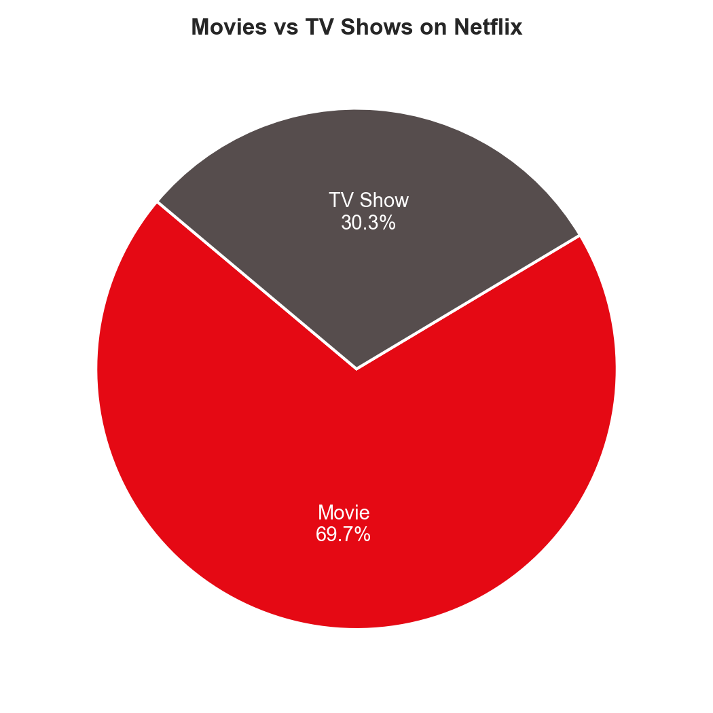
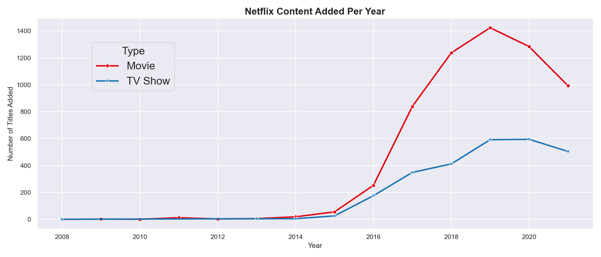
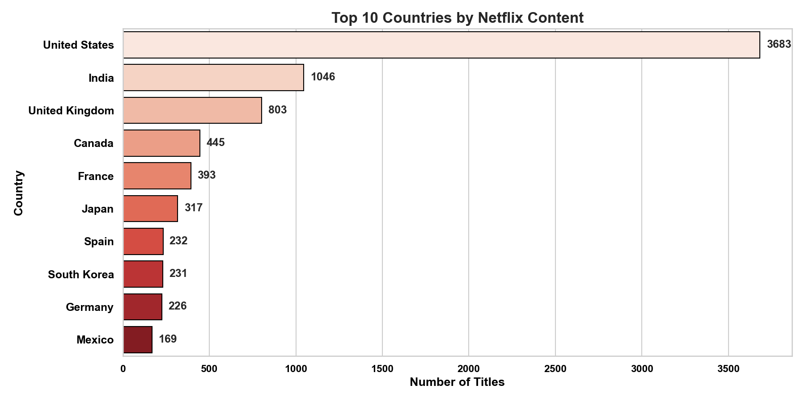
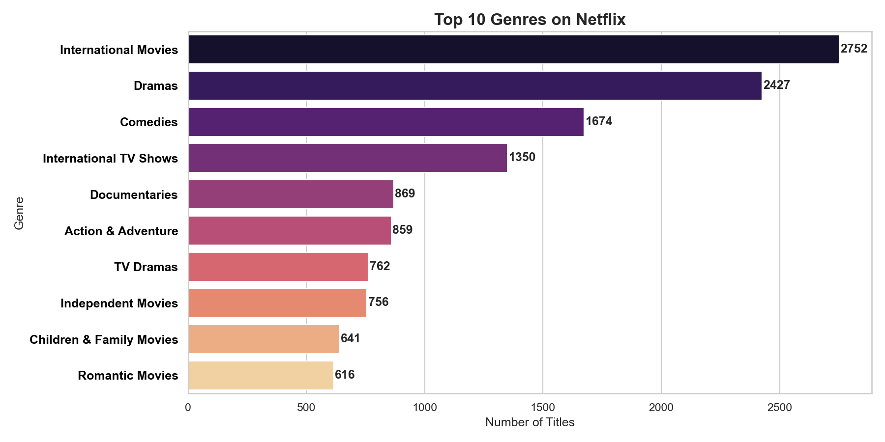
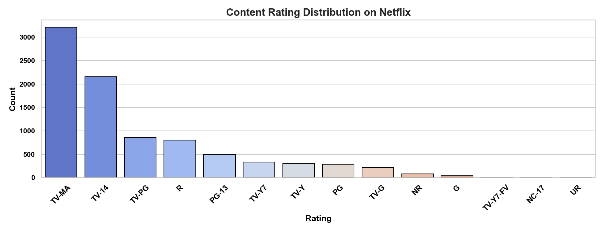
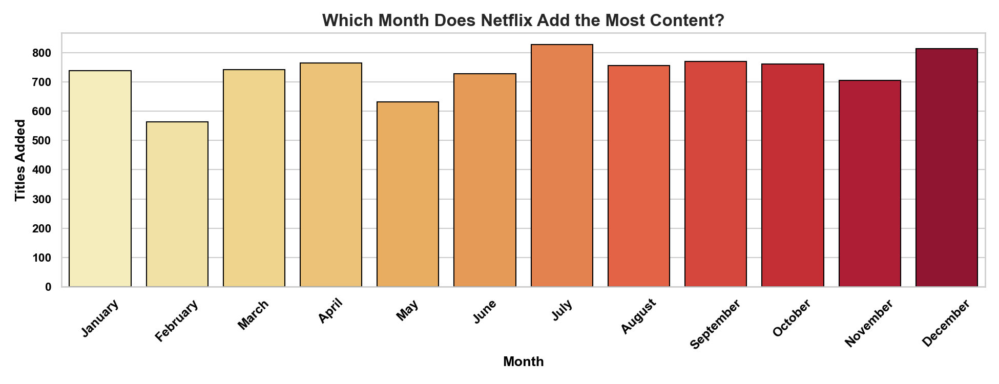
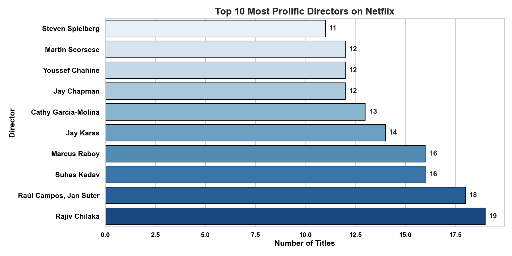

# 🎬 Netflix Content Analysis — Exploratory Data Analysis (EDA)


---

## 📌 Project Overview

This project performs a complete **Exploratory Data Analysis (EDA)** on Netflix's
global content library using Python. The goal is to uncover hidden patterns and
trends in Netflix's catalog — such as which countries produce the most content,
what genres dominate, how content has grown over time, and what ratings are most
common.

## 📈 Business Value

This analysis can help streaming platforms:

- Identify high-performing content types (Movies vs TV Shows)
- Optimize content release timing (peak months)
- Target high-production countries for investment
- Understand audience preferences via ratings distribution
- Improve content acquisition strategy

This demonstrates how raw data can be transformed into actionable business insights.

---

## 💼 Why This Project Matters

This project demonstrates real-world data analysis skills including:

- Data cleaning and preprocessing
- Feature engineering
- Exploratory data analysis (EDA)
- Data visualization and storytelling
- Extracting actionable business insights

Suitable for freelance work in:
- Data analysis
- Business intelligence
- Dashboard development
- Market trend analysis

  
## 🗂️ Dataset

| Detail | Info |
|---|---|
| **Source** | [Kaggle — Netflix Movies and TV Shows](https://www.kaggle.com/datasets/shivamb/netflix-shows) |
| **Rows** | 8,807 titles |
| **Columns** | 12 features |
| **Coverage** | Movies & TV Shows added up to mid-2021 |

### Columns in the Dataset
| Column | Description |
|---|---|
| `show_id` | Unique ID for each title |
| `type` | Movie or TV Show |
| `title` | Name of the content |
| `director` | Director name (29.9% missing) |
| `cast` | Main cast members |
| `country` | Country of production |
| `date_added` | Date added to Netflix |
| `release_year` | Original release year |
| `rating` | Content rating (TV-MA, PG-13, etc.) |
| `duration` | Duration in minutes or seasons |
| `listed_in` | Genre(s) |
| `description` | Short description |

---

## 🛠️ Tools & Libraries
```python
Python       3.8+
Pandas       — Data manipulation & cleaning
NumPy        — Numerical operations
Matplotlib   — Core plotting
Seaborn      — Statistical visualizations
Jupyter      — Interactive notebook environment
```

---

## 🧹 Data Cleaning Highlights

This dataset had several real-world data quality issues that were identified and fixed:

- ✅ **29.9% missing directors** — filled with `'Unknown'` (common for stand-up specials & documentaries)
- ✅ **9.4% missing cast & country** — filled with `'Unknown'`
- ✅ **Corrupted rating column** — 3 rows had duration values (`'74 min'`, `'84 min'`, `'66 min'`) 
  wrongly placed in the `rating` column. These were detected, moved to `duration`, and corrected.
- ✅ **10 rows with missing `date_added`** — dropped (time-based analysis requires valid dates)
- ✅ **Feature engineering** — extracted `year_added`, `month_added`, `month_name` and `duration_int`
  from raw columns for deeper analysis

**Final clean dataset: 8,797 rows, 0 NaN values**

---

## 📊 Analysis & Visualizations

### 1. 🎥 Movies vs TV Shows


Netflix's catalog is heavily skewed toward Movies (~70%) compared to TV Shows (~30%).

---

### 2. 📈 Content Added Over the Years


Netflix saw explosive content growth from 2016 to 2019, followed by a slight dip
likely due to COVID-19 production slowdowns.

---

### 3. 🌍 Top 10 Countries by Content


The **United States** leads by a wide margin, followed by **India** and the **United Kingdom**,
reflecting Netflix's global expansion strategy.

---

### 4. 🎭 Top 10 Genres


**International Movies**, **Dramas**, and **Comedies** dominate Netflix's genre catalog,
showing a strong push toward global audiences.

---

### 5. 🔞 Content Ratings Distribution


**TV-MA** (Mature Audiences) is the most common rating — Netflix clearly targets
adult viewers as its primary demographic.

---

### 6. 📅 Best Month to Add Content


**January** sees the highest content additions, likely tied to New Year viewership spikes.
**July** is also a peak month, aligned with summer binge-watching habits.

---

### 7. 🎬 Top 10 Most Prolific Directors


A small group of directors have contributed heavily to Netflix's catalog,
with strong representation from international filmmakers.

---

## 💡 Key Business Insights

| # | Insight |
|---|---|
| 1 | **Movies dominate** — 70% of all titles are Movies |
| 2 | **Content peaked in 2019** — Growth slowed post-COVID |
| 3 | **USA, India & UK** are the top 3 producing nations |
| 4 | **Mature content dominates** — TV-MA is the #1 rating |
| 5 | **International genres are huge** — Netflix bets on global content |
| 6 | **January & July** are peak upload months |
| 7 | **30% of titles have no director** — Gaps common in stand-up & docs |

---

## 📁 Project Structure
```
Netflix-EDA/
├── data/
│   └── netflix_titles.csv        ← Raw dataset
├── images/
│   ├── missing_values.png
│   ├── movies_vs_tvshows.png
│   ├── content_over_years.png
│   ├── top_countries.png
│   ├── top_genres.png
│   ├── ratings_distribution.png
│   ├── best_month.png
│   └── top_directors.png
├── notebooks/
│   └── Netflix_EDA.ipynb         ← Main analysis notebook
└── README.md
```

---

## 🚀 How to Run This Project

1. **Clone the repository**
```bash
git clone https://github.com/YOUR_USERNAME/Netflix-EDA.git
cd Netflix-EDA
```

2. **Install dependencies**
```bash
pip install pandas numpy matplotlib seaborn jupyter
```

3. **Launch Jupyter Notebook**
```bash
jupyter notebook
```

4. Open `notebooks/Netflix_EDA.ipynb` and run all cells from top to bottom.

---


